```{r setup, include=FALSE}
knitr::opts_chunk$set(dev = 'pdf')
par(mar = c(3,3,2,1), mgp = c(2,0.7,0), tck = -0.01, las = 1)
```

## Comenzamos

- Breve presentación:

  - ¿Quién eres,
  - donde estás,
  - cual es tu experiencia previa,
  - en qué estas trabajando,
  - cuales son tus intereses?

- Syllabus
- Requisitos

# Programa de hoy

## Día 1

Hora  | Tópicos
------------- | ----------------------------------------------------
8:00-9:30 | [Introducción a la evaluación de stock y manejo](https://github.com/LuisACubillos/curso_sibecorp_evastock_datlim/Clases/clase_1_introductoria.pdf)
9:30-9:45 | Pausa y café
9:45-10:45 | [Algunos modelos de evaluación de stock con datos limitados](https://github.com/LuisACubillos/curso_sibecorp_evastock_datlim/Clases/clase_2_modelos_datalim.pdf)
10:45-11:00 | Pausa y café
11:00-12:00 | Guía práctica: Demostración en R [(R scripts)](https://github.com/LuisACubillos/curso_sibecorp_evastock_datlim/Lab/tutorial_1_R_Demo_basics.pdf)

## Requisitos

1. Entrenamiento básico en biología de poblaciones, biología pesquera, ecología marina y evaluación de poblaciones.

2. Capacidades y entrenamiento previo de trabajo con [R](https://cran.r-project.org) utilizando [Rstudio](https://www.rstudio.com), además de experiencia básica de trabajo con [R Markdown](https://rmarkdown.rstudio.com).

**Nota**: Para las prácticas y análisis de casos de estudio se requiere instalar R  Versión 4.1.0 (2021-05-18) o más reciente que esté disponible en el sitio [CRAN](https://cran.r-project.org), y RStudio Version 1.4.1717 o más reciente que esté disponible en el sitio [RStudio desktop](https://www.rstudio.com/products/rstudio/#rstudio-desktop) (versión gratuita para PC). Una buena alternativa es trabajar con [RStudio cloud](https://rstudio.cloud).


## Consideraciones

- Este curso está disponible en GitHub.

- El programa está disponible en el [syllabus](https://luisacubillos.github.io/curso_sibecorp_evastock_datlim/syllabus.html), el cual permite acceder a las clases y tutoriales.

- Las presentaciones están en formato `Rmarkdown`.

- Si se detectan errores, pueden ser rápidamente corregidos.

- Para ello, el archivo `curso_sibecorp_evastock_datlim.Rproj` permite acceder al proyecto en `RStudio`.

## Modalidad y otros detalles

- Las clases teóricas se presentan primero, para posteriormente realizar una demostración, y por último una actividad práctica.

- La retroalimentación es esencial para avanzar.

## Curva de aprendizaje y motivación inteligente

- Afirmaciones:

  1. En el estado mental correcto puedo enfrentar cualquier desafío que me imponga.


## Curva de aprendizaje y motivación inteligente

 
 2. No necesito un esfuerzo heroico, es mejor avanzar paso a paso con incrementos pequeños y significativos.
 

## Curva de aprendizaje y motivación inteligente

 
 3. No cometo errores, sólo obtengo resultados.
 

## Curva de aprendizaje y motivación inteligente

 
 4. Tiene que ser divertido, disfrutar del proceso y de los resultados que estoy logrando.

## Curva de aprendizaje y motivación inteligente

 1. En el estado mental correcto puedo enfrentar cualquier desafío que me imponga.
 
 2. No necesito un esfuerzo heroico, es mejor avanzar paso a paso con incrementos pequeños y significativos.
 
 3. No cometo errores, sólo obtengo resultados.
 
 4. Tiene que ser divertido, disfrutar del proceso y de los resultados que estoy logrando.

## Curva de confianza
 
 1. __Confianza ensayada:__ visualizar metas y hacer una declaración afirmativa y poderosa acerca de lo que quiero lograr.
 


## Curva de confianza
 
 
 2.  __Confianza práctica:__ la práctica genera confianza, si repito 100 veces un procedimiento, cuando lo haga una vez más lo haré bien y tal vez mejor


## Curva de confianza
 
 3. __Confianza aceptada:__ Cuando no sé cómo hacer algo, reconozco que nada sé y me permito intentar y descubrir lo que puede aprender.


## Curva de confianza
 
 1. __Confianza ensayada:__ visualizar metas y hacer una declaración afirmativa y poderosa acerca de lo que quiero lograr.
 
 2. __Confianza práctica:__ la práctica genera confianza, si repito 100 veces un procedimiento, cuando lo haga una vez más lo haré bien y tal vez mejor
 
 3. __Confianza aceptada:__ Cuando no sé cómo hacer algo, reconozco que nada sé y me permito intentar y descubrir lo que puede aprender.


## Siempre, siempre...


Celebrar !!!


## Entrando en materia . . .

¿Qué se entiende por evaluación de stock?

## Evaluación de stock

- Involucra el uso de cálculos estadísticos y matemáticos para realizar predicciones cuantitativas de las respuestas de un stock frente a alternativas de manejo distintas ([Hilborn y Walters 1992](https://www.springer.com/gp/book/9780412022715)). \vspace{1cm}

\small Hilborn y Walters 1992 https://www.springer.com/gp/book/9780412022715

## Evaluación de stock

- "La evaluación de stock comprende todo estudio científico para determinar la productividad de un recurso pesquero, las repercusiones de la pesca en dicho recurso y los efectos (sobre el recurso y la pesca) de cambiar las modalidades de la explotación pesquera; por ejemplo, con respecto a la ejecución de la ordenación o políticas de desarrollo." \vspace{1cm}

\small Gulland (1983) El porqué de la evaluación de Poblaciones.

## Rol de la evaluación de stock

- El rol de la evaluación de stocks es proveer un soporte técnico acerca de la condición del stock y de los efectos sobre el stock y la pesquería de las acciones que están siendo contempladas. \vspace{1cm}

\small Hilborn y Walters (1992)

## Manejo

¿Qué se entiende por manejo/ordenamiento pesquero?

## Manejo

"Proceso integrado de recolección de información, análisis, planificación, consulta, adopción de decisiones, asignación de recursos, formulación y ejecución, así como la imposición de decisiones cuando sea necesario, de reglamentos o normas que rijan las actividades pesqueras para asegurar la (conservación) y la productividad de los recursos y la consecución de otros objetivos". \vspace{1cm}

\tiny Cochrane, KL (2005) Guía del administrador pesquero. Medidas de ordenación y su aplicación. [A fishery manager's guidebook. Management measures and their application] Serie: FAO Documento Técnico de Pesca. 424. 231 p.

**Ver también**: 
\tiny Cochrane, KL (2021) Reconciling sustainability, economic efficiency and equity in marine fisheries: Has there been progress in the last 20 years?. Fish Fish. 2021; 22: 298– 323. https://doi.org/10.1111/faf.12521

## Manejo

- El ámbito del manejo/ordenamiento es la toma de decisiones respecto de un objetivo.

- Las decisiones implican consecuencias acerca de las acciones que están siendo contempladas.

- Los objetivos y las acciones se enmarcán en procedimientos de manejo contenidos en un plan de manejo.

**Recordar**: El evaluador de stock debe proveer sustento:

-	Evaluar las consecuencias de acciones de manejo alternativas (modelo de proyección) y medidas de desempeño.

## Ciclo de manejo y PBR

{width=70%}

\tiny Kvamsdal et al. (2016) Harvest control rules in modern fisheries management. Elementa: Science of the Anthropocene 4, 000114. [doi: https://doi.org/10.12952/journal.elementa.000114](https://doi.org/10.12952/journal.elementa.000114)


## Ciclo de manejo y HCR

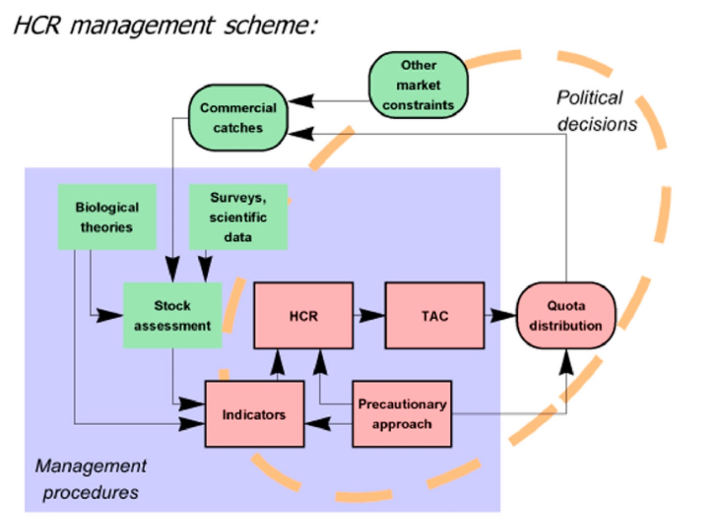{width=70%}

\tiny Kvamsdal et al. (2016) Harvest control rules in modern fisheries management. Elementa: Science of the Anthropocene 4, 000114. [doi: https://doi.org/10.12952/journal.elementa.000114](https://doi.org/10.12952/journal.elementa.000114)

## Procedimiento de manejo

1. Objetivo de manejo
2. Marco biológico para la explotación
3. Puntos biológicos de referencia
4. Provisión de datos a través del seguimiento de la pesquería (monitoreo), y control de capturas.
5. Evaluación del estatus del recurso
6. Regla de control
7. Captura biológicamente aceptable

## Objetivo y marco biológico

El estado de situación de un stock de peces se puede determinar al contrastar los indicadores de su explotación actual con _puntos de referencias que miden una situación deseable y no deseable de la explotación_.

El concepto de máximo rendimiento sostenible (MRS), o MSY por su sigla en inglés (maximum sustainable yield), constituye el fundamento de la mayoría de los puntos biológicos de referencia.

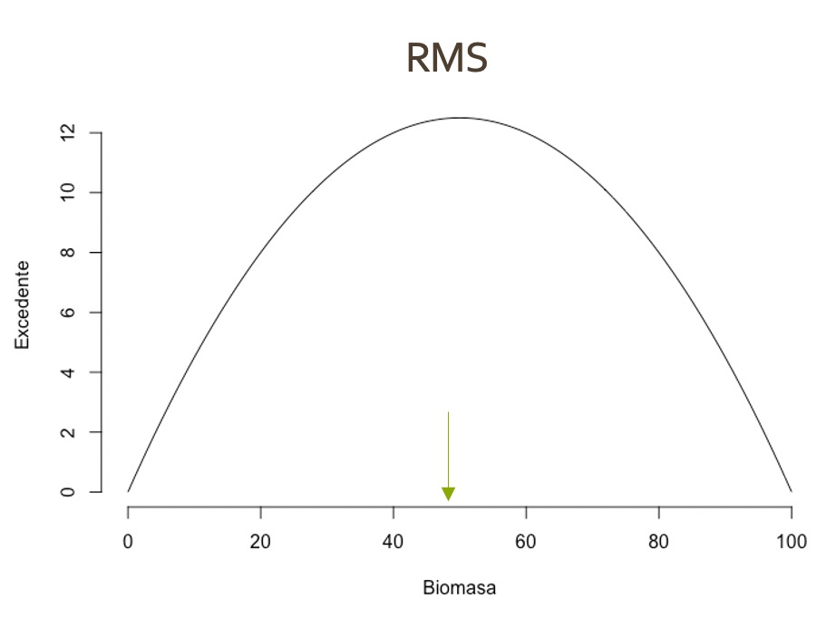{width=30%}


## PBR

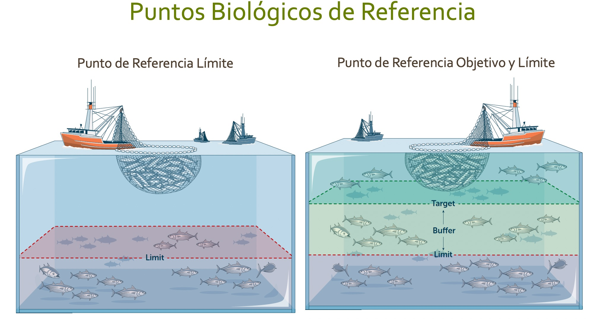{width=90%}


\tiny Fuente: https://www.pewtrusts.org/


## Riesgos biológicos

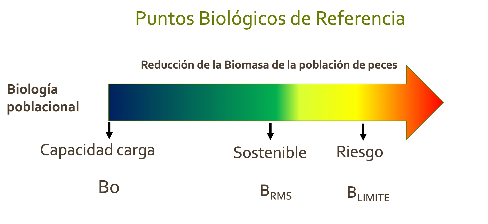

## PBR y objetivos de manejo

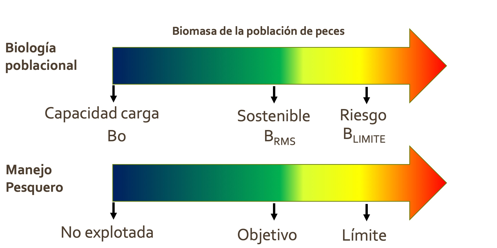

## Ciclo operacional anual

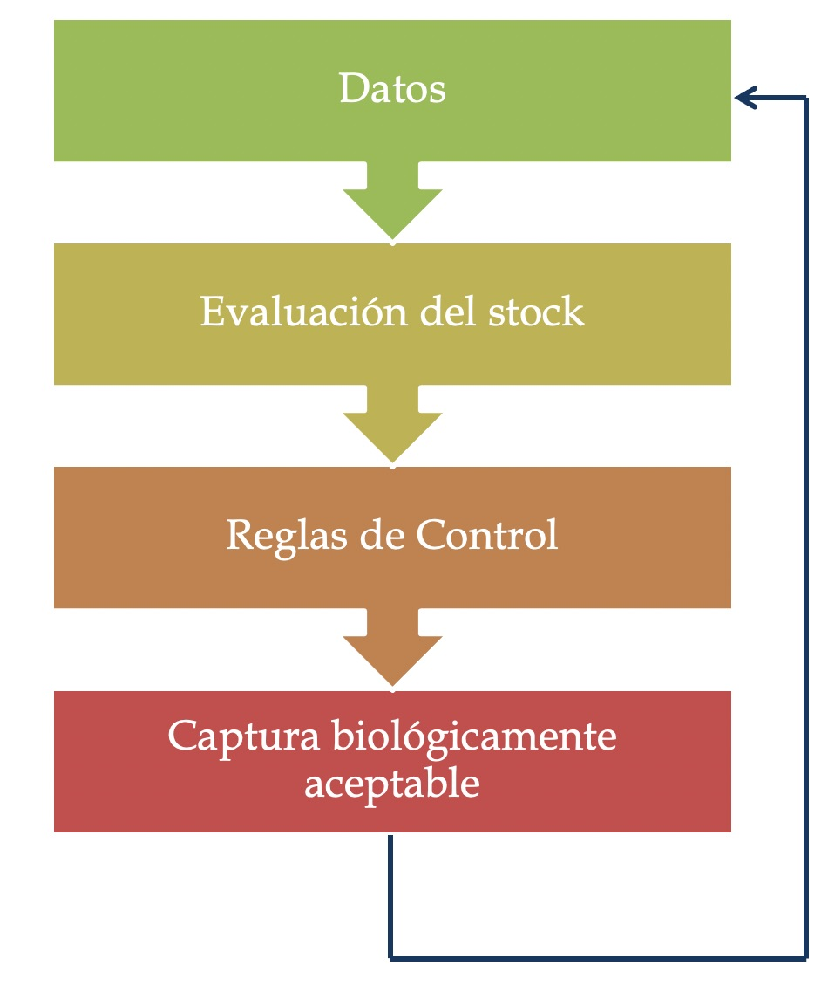{width=50%}

## Datos

- ¿Qué tipo de datos son necesarios para reducir incertidumbre en la evaluación de stock?

## Datos limitados

- ¿Qué constituye una pesquería limitada en datos (data-limited)?

- ¿Cómo se diferencia de una pesquería moderada en datos (data-moderate), o abundante en datos (data-rich)?

- ¿Tenemos una definición explícita para cada uno de estos términos?

## Datos disponibles

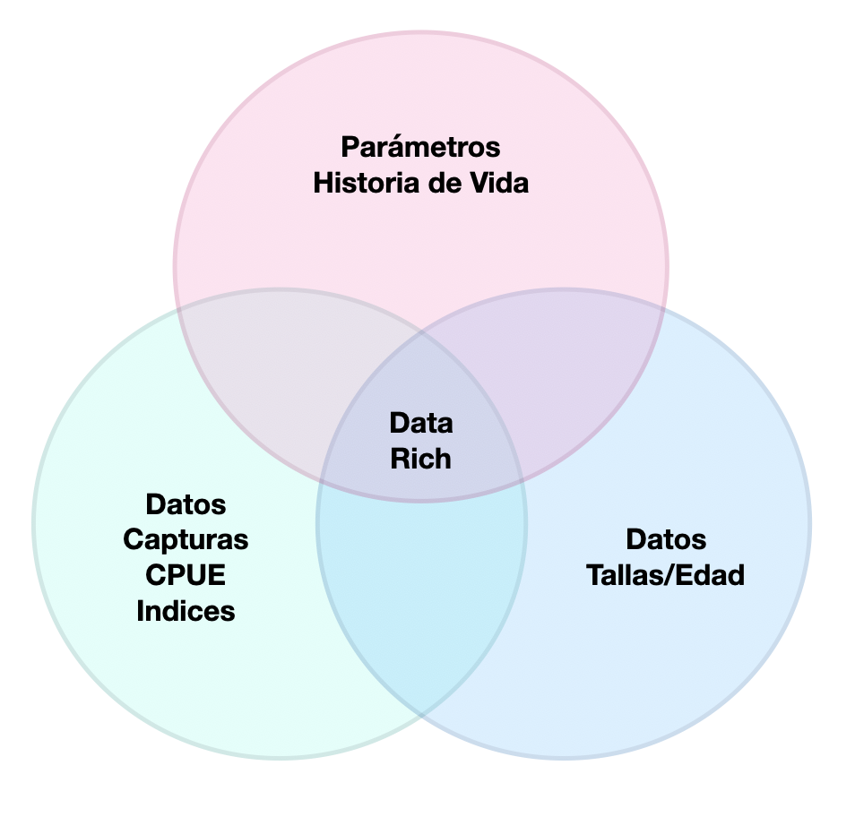{width=60%}

## Consideraciones

1. __Sistemas complejos__: La dinámica de las pesquerías son complejas, e incluso las pesquerías más conocidas muestran carencias, limitaciones y brechas que generan incertidumbre para comprender la dinámica poblacional y los efectos de la pesca.

2. __Sistema de niveles__: Es importante establecer un sistema de niveles o categorías que permita clasificar a las pesquerías según el conocimiento existente, los datos disponibles, y los métodos que pueden o deben ser aplicados, y las acciones para emprender una manejo adaptable que transite hacia niveles más altos.

## La evaluación y manejo de pesquerías limitadas en datos

- Metas para la evaluación científica del estado de las poblaciones

1. Utilizar flujos de datos que no suelen ser utilizados para la evaluación de las poblaciones

2. Extraer información relevante para la gestión de las pesquerías a partir de las evaluaciones de las poblaciones mediante la ampliación del uso de marcos de gestión adaptativa.

3. Utilizar diseños centrados en el ser humano para desplegar tecnologías apropiadas para aumentar drásticamente la cantidad de datos, que incluso con recursos limitados, se pueden recopilar, analizar y aplicar a la gestión.

\tiny Fujita (2021) Marine Policy 133, 104730. [https://doi.org/10.1016/j.marpol.2021.104730](https://doi.org/10.1016/j.marpol.2021.104730)

## Ejemplos de Sistemas de niveles

### NFMS, NOAA

* __Estándar completo__ (data-rich): Estimaciones confiables del RMS, o cantidades relacionadas. Evaluación de stock sofisticada.

* __Estándar medio__ (data-medium): Estimaciones poco confiables del RMS, o cantidades relacionadas. Peculiaridades de la historia de vida, pobreza en el contraste de datos, o alta variabilidad del reclutamiento. PBR genéricos basados en estimaciones por recluta.

* __Estándar pobre__ (data-poor): Se carece de estimaciones confiables del RMS, de la abundancia, y de los parámetros de historia de vida. La evaluación es mínima, incertidumbre cualitativa. Enfoques empíricos, o reglas pre-acordadas en base a la historia de las capturas.

\tiny Restrepo y Powers (1999) ICES Journal of Marine Science 56, 846–852. [https://doi.org/10.1006/jmsc.1999.0546](https://doi.org/10.1006/jmsc.1999.0546)

## El caso de las pesquerías en Chile

\tiny Payá et al. (2014) Revisión de los puntos biológicos de referencia (Rendimiento Máximo Sostenible) en las pesquerías nacionales. [http://dx.doi.org/10.13140/RG.2.1.3048.0246](http://dx.doi.org/10.13140/RG.2.1.3048.0246) 

### Sistema de niveles

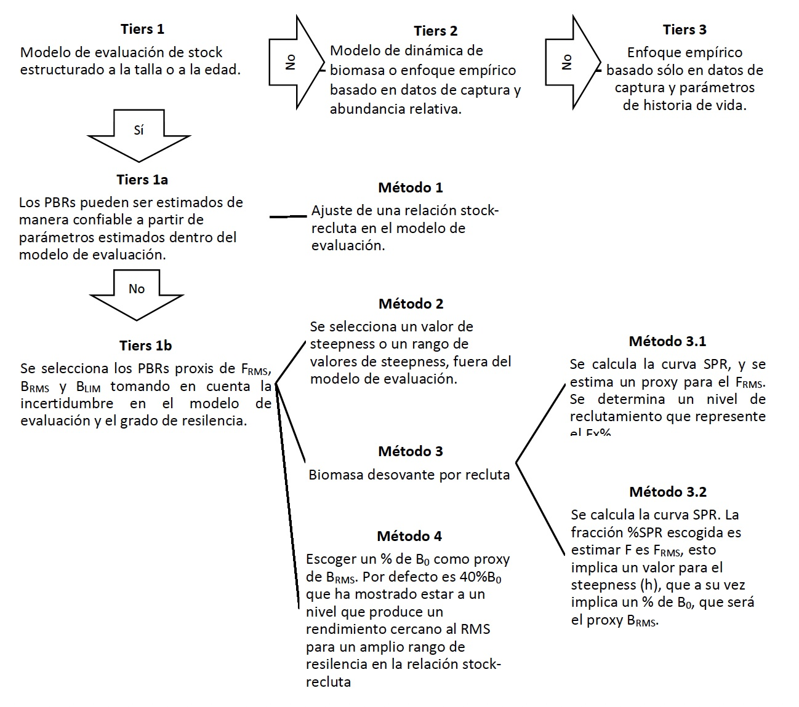{width=50%}

## Categoría 3 del sistema en Chile

### Enfoque empírico

- Basado sólo en datos de captura (no existe un índice de abundancia), incertidumbre en los registros de desembarque (subreporte, pesca no formalizada, pesca ilegal)

- Se podrían utilizar datos de cruceros científicos, si están disponibles.

- Parámetros de historia de vida estimados empíricamente de especies similares.

- Cristerios expertos acerca de percepciones del grado de agotamiento y segmentos de las series de capturas con relación al RMS.

## Marcos para un enfoque adaptativo

* [FishPath https://www.fishpath.org](https://www.fishpath.org)

* [FISHE http://fishe.edf.org](http://fishe.edf.org)

## FishPath

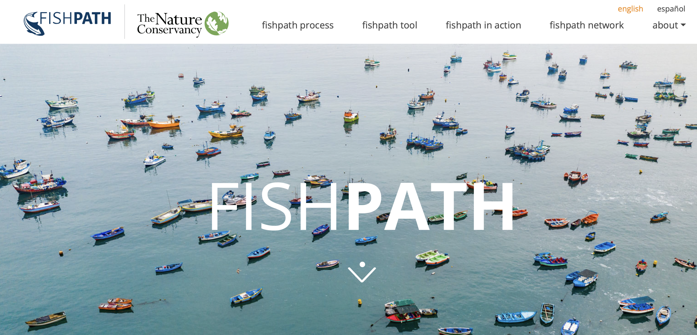
\tiny [FishPath https://www.fishpath.org](https://www.fishpath.org)

## FishPath (cont.)

**FishPath**: Sistema de apoyo para la toma de decisiones que permite a los usuarios de una pesquería analizar:

1. Información disponible,
2. Atributos biológicos/ciclo de vida de las especies relevantes,
3. Características operacionales de la pesquería;
4. Características socioeconómicas; y,
5. Contexto de gobernanza.

**FishPath** es un enfoque integral y estandarizado para guiar la selección de opciones de monitoreo, evaluación y __reglas de decisión__ para pesquerías con datos limitados.

## FISHE

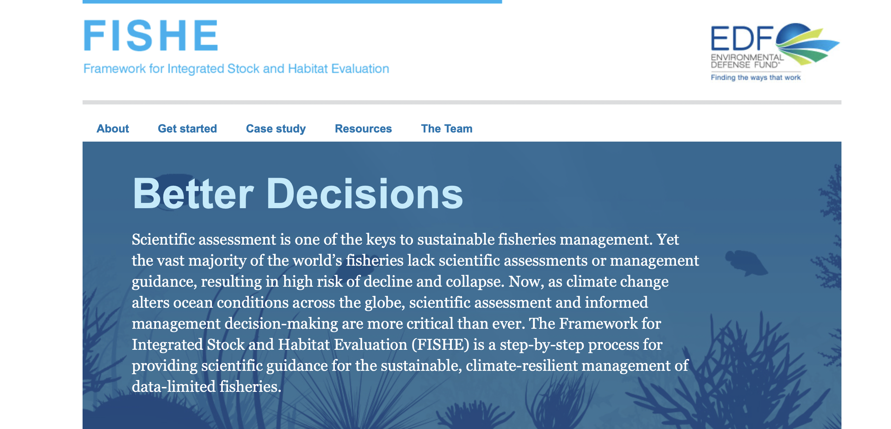
\tiny [FISHE http://fishe.edf.org](http://fishe.edf.org)

## FISHE (cont.)

**Framework for Integrated Stock and Habitat Evaluation (FISHE)**: El Marco para la Evaluación Integrada de Poblaciones y Hábitats es un proceso paso a paso que proporciona orientación científica para la gestión sostenible y resistente al clima de pesquerías con datos limitados.

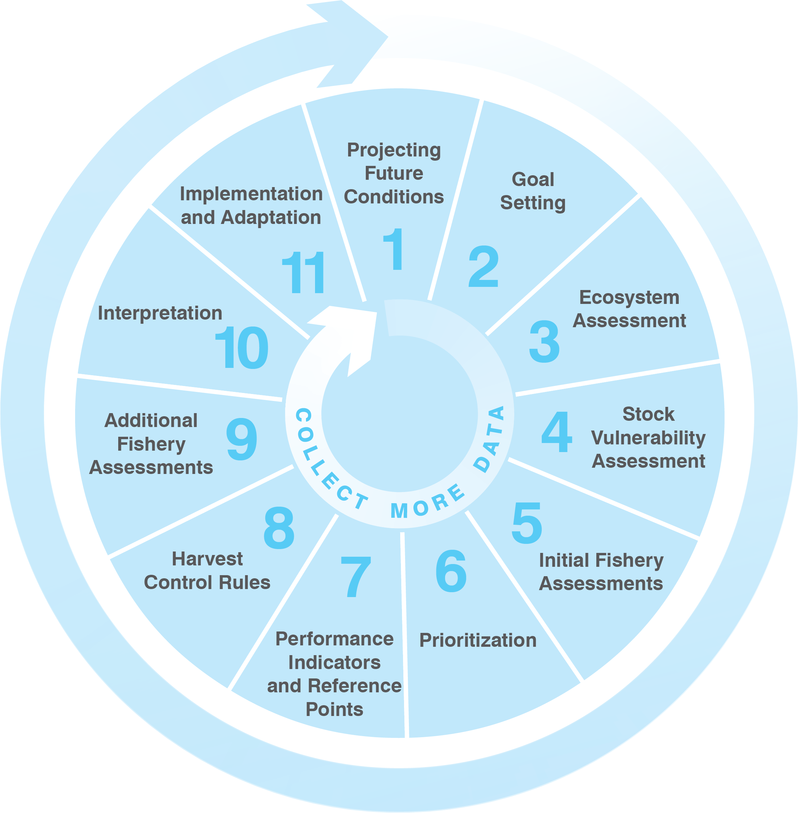{width=30%}


\tiny [FISHE http://fishe.edf.org](http://fishe.edf.org)

## Evaluación de stock y manejo con datos limitados

* Modelos basados sólo en capturas o índices

* Modelos basados sólo en tallas

* Modelos basados en tallas e índices

## Reglas de control

* Reglas de control para la explotación, o reglas de control de captura, o harvest control rules (HCR)

Son reglas que indican a los administradores lo que deben hacer cuando se comprueba que los indicadores de rendimiento cumplen o no sus objetivos, cuando se acercan a PBR límites o los sobrepasan.

## HCR (cont.)

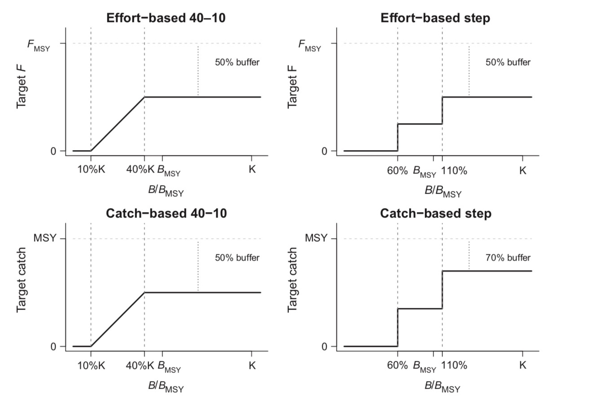{width=50%}

\tiny [Walsh, J.C., Minto, C., Jardim, E., et al. (2018) Trade-offs for data-limited fisheries when using harvest strategies based on catch-only models. Fish Fish. 19, 1130– 1146. https://doi.org/10.1111/faf.12316](https://doi.org/10.1111/faf.12316)

## Evaluación de estrategias de manejo

- __Evaluación de Estrategias de Manejo__: (EEM) Es un enfoque de evaluación de procedimientos de manejo sobre la base de simulaciones de ciclo cerrado con retroalimentación (Punt et al. 2016).

- Permite identificar la(s) estrategia(s) de explotación con mejor desempeño bajo incertidumbre, considerando errores de medición, errores de proceso, e incertidumbre estructural en la modelación.

\tiny [Punt, A.E., Butterworth, D.S., de Moor, C.L., De Oliveira, J.A.A. and Haddon, M. (2016). Management strategy evaluation: best practices. Fish Fish 17, 303-334. https://doi.org/10.1111/faf.12104](https://doi.org/10.1111/faf.12104)

## EEM (cont.)

- Simulaciones de ciclo cerrado con retroalimentación

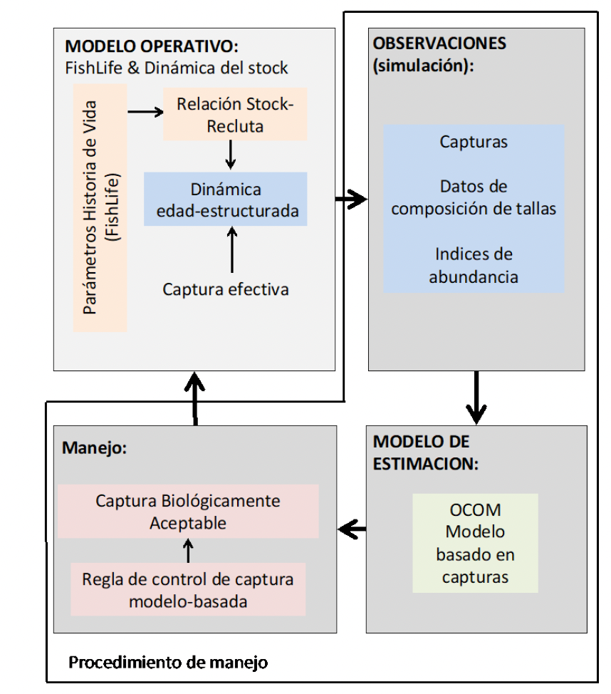{width=40%}

## Herramientas disponibles

* DLMtool

* OpenMSE

## Data-limited methods Toolkit (DLMtool)

{width=70%}

\tiny https://www.datalimitedtoolkit.org

\tiny Carruthers, TR, Hordyk, AR. The Data-Limited Methods Toolkit (DLMtool): An R package for informing management of data-limited populations. Methods Ecol Evol. 2018; 9: 2388– 2395. [https://doi.org/10.1111/2041-210X.13081](https://doi.org/10.1111/2041-210X.13081)

## OpenMSE

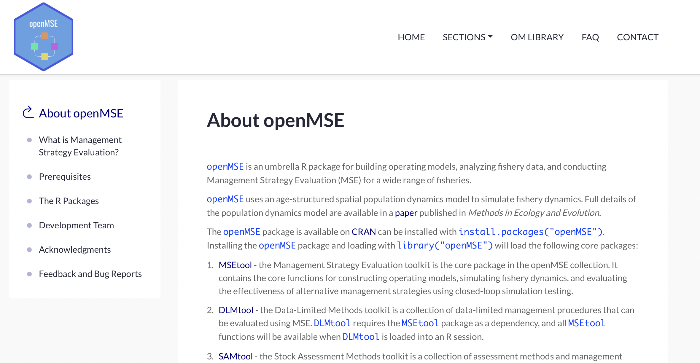

\tiny https://openmse.com/welcome-about-openmse/

## Pausa y café

\centering
{width=70%}
