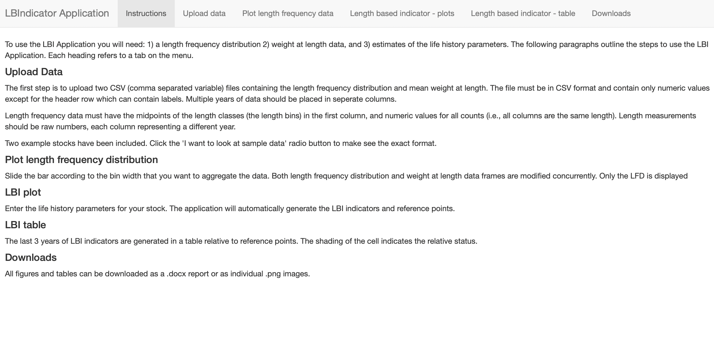

```{r setup, include=FALSE}
knitr::opts_chunk$set(dev = 'pdf')
par(mar = c(3,3,2,1), mgp = c(2,0.7,0), tck = -0.01, las = 1)
```


## Modelos basados en tallas

### Length-based indicators (LBI)

__Indicadores basados en la talla__:

- Distribuciones de frecuencia de tallas de muestras obtenidas de las capturas, o cruceros.
- Parámetros de historia de vida (crecimiento, longitud de madurez, longitud de primera captura, mortalidad natural).

__ICES MSY framework__ utiliza esta información para elaborar indicadores para:

1. La conservación de los individuos grandes (i.e., el potencial reproductivo)
2. Conservación de peces inmaduros
3. Rendimiento máximo sostenible (RMS)

\tiny [ICES WKDLSSLS https://www.ices.dk/community/groups/Pages/WKDLSSLS.aspx](https://www.ices.dk/community/groups/Pages/WKDLSSLS.aspx)

**Ver además**
\tiny [SEAFISH https://www.seafish.org](https://www.seafish.org/responsible-sourcing/fisheries-management/sustainable-fisheries-assessment-and-management-guides/data-limited-fisheries/)

## LBI

- Conservación de individuos grandes, mega desovantes ($L_{mega}$), inmaduros ($L_{25\%}$), y rendimiento óptimo :

Indicador     | Referencia     |  Razón                   | Valor esperado
------------- | -------------- | ------------------------ |--------------
$L_{95\%}$    | $L_{\infty}$   | $L_{95\%}/L_{\infty}$   |  $>0.8$
$L_{max5\%}$  | $L_{\infty}$   | $L_{max5\%}/L_{\infty}$   |  $>0.8$   
$P_{mega}$     | $0.3-0.4$   | $P_{mega}$   |  $>0.3$ 
$L_{25\%}$    | $L_{m}$   | $L_{25\%}/L_{m}$   |  $>1$
$L_{c}$    | $L_{m}$   | $L_{c}/L_{m}$   |  $> 1$
$L_{mean}$    | $L_{opt}$   | $L_{mean}/L_{opt}$   |  $\sim 1$
$L_{maxy}$    | $L_{opt}$   | $L_{maxy}/L_{opt}$   |  $\sim 1$
$L_{mean}$    | $L_{F=M}$   | $L_{mean}/L_{F=M}$   |  $\geq 1$

## Notas LBI

$L_{opt} = 3/(3+M/K)L_{\infty}$

$L_{F=M}=(1-a)L_c + aL_{\infty}$

donde:

$a=1/(2(M/K))+1)$

- Cuando $M/K=1.5$:

$L_{opt}=2/3L_{\infty}$

$L_{F=M}=0.75L_c + 0.25L_{\infty}$

\tiny [ICES. 2018. Report of the Workshop on Length-Based Indicators and Reference Points for Elasmobranchs (WKSHARK4), 6 -9 February 2018, Ifremer, Nantes (France). 112 pp.](https://www.ices.dk/sites/pub/Publication%20Reports/Expert%20Group%20Report/acom/2018/WKSHARK4/WKSHARK4_Report2018.pdf)

## Notas LBI (Cont.)

- Indicadores de conservación de individuos más grandes:


\tiny [Tesfaye, G., Wolff, M. 2015. Revista de Biología Tropical 63, 755-770 https://doi.org/10.15517/rbt.v63i3.16715 ](https://doi.org/10.15517/rbt.v63i3.16715)

## Notas LBI (Cont.)

- Indicadores de conservación de individuos más grandes:

$L_{95\%}$: Percentil 95%, principalmente estadístico.

$L_{max5\%}$: Longitud media del 5% de los individuos más grandes en las capturas (Probst et al. 2013; Miethe et al. 2019)

\tiny [Probst, W.N., Kloppmann, M., Kraus, G. 2013. Indicator-based status assessment of commercial fish species in the North Sea according to the EU Marine Strategy Framework Directive (MSFD), ICES Journal of Marine Science 70, 694–706. https://doi.org/10.1093/icesjms/fst010](https://doi.org/10.1093/icesjms/fst010)

\tiny [Miethe, T., Reecht, Y., Dobby, H. 2019. Reference points for the length-based indicator Lmax5% for use in the assessment of data-limited stocks, ICES Journal of Marine Science 76, 2125–2139. https://doi.org/10.1093/icesjms/fsz158](https://doi.org/10.1093/icesjms/fsz158)

## Notas LBI (Cont.)

- Protección de mega reproductores

$P_{mat}=\sum_{L_{m}}^{L_{max}}P_l$

$P_{opt}=\sum_{0.9L_{opt}}^{1.1L_{opt}}P_l$

$P_{opt}=\sum_{1.1L_{opt}}^{L_{max}}P_l$

\tiny [Cope, J.M., Punt, A.E. 2009. Length-Based reference points for data-limited situations: Applications and restrictions. Marine and Coastal Fisheries 1, 169-186. https://doi.org/10.1577/C08-025.1](https://doi.org/10.1577/C08-025.1)

## Software disponibles

- Análisis de datos de frecuencia de tallas y parámetros de historia de vida:

[TropFishR](https://doi.org/10.1111/2041-210X.12791)

\tiny [Mildenberger, T.K., Taylor, M.H. and Wolff, M. 2017. TropFishR: an R package for fisheries analysis with length-frequency data. Methods Ecol Evol, 8: 1520-1527. https://doi.org/10.1111/2041-210X.12791](https://doi.org/10.1111/2041-210X.12791)

- Parámetros de historia de vida

[FishLife](https://github.com/James-Thorson-NOAA/FishLife)

\tiny [Thorson, J. T., Munch, S. B., Cope, J. M., & Gao, J. (2017). Predicting life history parameters for all fishes worldwide. Ecological Applications, 27(8), 2262–2276. https://doi.org/10.1002/eap.1606](https://doi.org/10.1002/eap.1606)


## Aplicación Shiny

[https://scott.shinyapps.io/LBIndicator_shiny/](https://scott.shinyapps.io/LBIndicator_shiny/)

Codigo:
[ICES-tools-dev/LBIndicator_shiny](https://github.com/ices-tools-dev/LBIndicator_shiny)

Otras:
[ICES-tools-dev/ICES_MSY](https://github.com/ices-tools-dev/ICES_MSY)

## Aplicación

[https://scott.shinyapps.io/LBIndicator_shiny/](https://scott.shinyapps.io/LBIndicator_shiny/)



## Potencial reproductivo basado en talla

$$SPR = \frac{\text{Potencial Reproductivo Explotado}}{\text{Potencial Reproductivo Inexplotado}}$$
SPR puede ser calculado a la talla, considerando la razón $M/K$, $F/M$, y $L_m/L_{\infty}$

$$SPR=\frac{\sum (1-{L_x})^{M/K(F/M-1)}{L_x}^3}{\sum (1-{L_x})^{M/K}{L_x}^3}$$

$L_x$: longitud esperada (estandarizada) a la edad $x$. 

\tiny [Hordyk, A.R., Ono, K., Sainsbury, K.J., Loneragan, N., and Prince, J.D. 2015a. Some explorations of the life history ratios to describe length composition, spawning-per-recruit, and the spawning potential ratio. ICES J. Mar. Sci. 72: 204 - 216. https://doi.org/10.1093/icesjms/fst235](https://doi.org/10.1093/icesjms/fst235)

\tiny [Hordyk, A.R., Ono, K., Valencia, S.R., Loneragan, N.R., and Prince, J.D. 2015b. A novel length-based empirical estimation method of spawning potential ratio (SPR), and tests of its performance, for small-scale, data-poor fisheries. ICES J. Mar. Sci. 72: 217 – 231.](https://doi.org/10.1093/icesjms/fsu004)

## Invariantes de Beverton-Holt

- Cuando: $L_m/L_{\infty} \sim 0.66$ y $M/K \sim 15$

{width=50%}

\tiny [Prince, J.D., Hordyk, A.R., Valencia, S.R., Loneragan, N.R., and Sainsbury, K.J. 2015. Revisiting the concept of Beverton–Holt life-history invariants with the aim of informing data-poor fisheries assessment. ICES J. Mar. Sci. 72: 194 - 203. https://doi.org/10.1093/icesjms/fsu011](https://doi.org/10.1093/icesjms/fsu011)

## LBSPR y selectividad

- Length-based GTG (growth-type-group), concepto asociado con el [fenómeno de Rosa Lee](https://pesquerias-chilenas.blogspot.com/2020/02/); i.e.,
"La población de más edad está sesgada por peces de crecimiento más lento, ya que los peces de crecimiento más rápido murieron a una edad más temprana."

- GTG LB-SPR estima consistentemente valores más bajos de $F/M$ comparado con $LB-SPR$

\tiny [Hordyk, A., Ono, K., Prince, J.D., and Walters, C.J. 2016. A simple length-structured model based on life history ratios and incorporating size-dependent selectivity: application to spawning potential ratios for data-poor stocks. Can. J. Fish. Aquat. Sci. 13: 1– 13. https://doi.org/10.1139/cjfas-2015-0422](https://doi.org/10.1139/cjfas-2015-0422)

## LBSPR: Length-Based Spawning Potential Ratio

[Vignettes LBSPR](http://adrianhordyk.github.io/LBSPR/articles/LBSPR.html)

[http://barefootecologist.com.au/lbspr](http://barefootecologist.com.au/lbspr)

{width=70%}

## Interpretación

{width=70%}

## Length-Based Bayesian Biomass estimator

{width=50%}

\tiny [Froese, R., Winker, H., Coro, G., Demirel, N., Tsikliras, A.C., Dimarchopoulou, D., Scarcella, G., Probst, W.N., Dureuil, M. and Pauly, D., 2018. A new approach for estimating stock status from length frequency data. ICES Journal of Marine Science, 75(6), 2004-2015.](https://doi.org/10.1093/icesjms/fsy078)

## LBB (Cont.)

- Datos: Captura a la talla

{width=60%}

[GEOMAR https://oceanrep.geomar.de/43182/](https://oceanrep.geomar.de/43182/)

[https://github.com/SISTA16/LBB](https://github.com/SISTA16/LBB)

## LBB (cont.)

$$N_{L_i}=N_{L_{i-1}}S_{L_i}F ((L_{\infty}-L_i)/(L_{\infty}-L_{i-1}))^{M/K+F/KS_{L_i}}$$
$F$ se cancela al dividir ambos lados por la suma.

Enfoque Bayesian, con priors obtenidos de datos previos o agregados de frecuencia de tallas, y estimación simultánea de $L_{\infty}, L_c,M/K,F/K=(F/K)/(M/K)$ .

## LBB (cont.)

- Proxy de $B_{RMS}$, cuando $L_c = L_{opt}$ y $F/M=1$, i.e.,

$$\frac{B}{B_0}=\frac{CPUE'/R}{B_0'>L_c/R}$$

$CPUE'/R$ y $B_0'/R$ son indices por recluta.

## LBB (cont.)

{width=60%}

## LIME

LIME: Length-based Integrated Mixed Effects

- Requiere un solo año de datos de talla e información biológica básica.

- Puede ajustarse a varios años de datos de talla con múltiples flotas (y capturas y un índice de abundancia si están disponibles).

- LIME evita la necesidad de hacer suposiciones de equilibrio, y mejora las evaluaciones data-poor.

- [Aplicación Shiny](https://github.com/merrillrudd/LIME_shiny)

\tiny [Rudd, M.B., Thorson, J.M. 2018. Accounting for variable recruitment and fishing mortality in length-based stock assessments for data-limited fisheries. Canadian Journal of Fisheries and Aquatic Sciences. 75(7): 1019-1035.](https://doi.org/10.1139/cjfas-2017-0143)

## Modelos basados sólo en capturas

- Clasificación de estatus:

    - Clasificación de estatus (Froese et al., 2012; Anderson et al., 20)
    - Enfoque ORCS mejorado (Free et al., 2017)

- Modelos de producción, p.e.:

    - CMSY (Martell y Froese, 2013)
    - OCOM (Zhou et al., 2017)

## Clasificación de estatus

Criterios utilizados para asignar estados a datos de captura ($Y$) relativos a la máxima captura registrada ($Y_{max}$), capturas relativas al $RMS$, y biomasa relativa al $B_{RMS}$.

Indicador       | Año            |  $Y/Y_{max}$   | $Y/RMS$   | $B/B_{RMS}$
----------------|--------------- |--------------- | --------- | ----------
Subdesarrollada | Antes de $Y \geq Y_{max}$ | < 0.1  | <0.1   |
En desarrollo   |        -       | 0.1 a 0.5 | 0.2 a 0.75  | $>1.5$
Explotación plena | Después de $Y \geq Y_{max}$ | > 0.5  | $>0.75$   | $\leq 0.5$
Sobreexplotación |       -       | 0.1 a 0.5 | 0.2 a 0.75  | $<0.5$
Colapso         |        -       |  < 0.1   | < 0.2      |  <0.1

Recuperación: Año entre el colapso y el primer año subsecuente de explotación plena.

\tiny [Froese, R., Zeller, D., Kleisner, K., & Pauly, D. (2012). What catch data can tell us about the status of global fisheries. Marine Biology, 159(6), 1283–1292. doi:10.1007/s00227-012-1909-6](https://doi.org/10.1007/s00227-012-1909-6)

## Dynamic catch-based method

- El problema de máximos atípicos

{width=50%}

\tiny [Anderson, S. C., Branch, T. A., Ricard, D., and Lotze, H. K. 2012. Assessing global marine fishery status with a revised dynamic catch-based method and stock-assessment reference points. – ICES Journal of Marine Science, 69:1491-1500](https://doi.org/10.1093/icesjms/fss105)

## Modelo de biomasa dinámica

$$B_{t+1}=B_t + rB_t(1-B_t/k)-C_t$$
Encontrar la mejor combinación entre $r$ y $k$ que minimize la diferencia entre la biomasa observada y estimada.

$B=CPUE/q$

## Métodos

- __Catch-MSY__: Catch-Based MSY estimation ([Martell y Froese, 2013](https://doi.org/10.1111/j.1467-2979.2012.00485.x))
- __CMSY__: Catch Maximum Sustainable Yield 2 ([Froese et al., 2017](https://doi.org/10.1111/faf.12190))
- __BSM__: Bayesian State-Space Surplus Production ([Froese et al., 2017](https://doi.org/10.1111/faf.12190))
- __OCOM__: Optimized Catch-Only Model ([Zhou et al., 2017](https://10.1093/icesjms/fsx226))
- __SSCOM__: State-Space Catch Only Model ([Thorson et al., 2013](https://doi.org/10.1139/cjfas-2013-0280))
- __zBRT__: Boosted Regression Tree ([Zhou et al., 2017](https://doi.org/10.1111/faf.12201)) 

## Parámetros de historia de vida

$r=2F_{RMS} \sim 2M \sim 3K \sim 2/3M \sim 9/t_{max} \sim 3.3/t_{gen}$

- Relaciones utilizadas para predecir $r$ en FISHBASE

- Resiliencia qualitativa (Very Low, Low, Medium, High) y rangos para $r$ están disponibles e FISHBASE.

- Ante ausencia de índices de abundancia, $r$ puede ser obtenido de rasgos de historia de vida y un rango para $k$ de la captura máxima.

## Casos especiales

Las capturas son series de tiempo, influenciadas por múltiples factores distintos que la pesca, por ejemplo:

- Cambios de régimen

- Incremento monótono

- Disminución monótona

## Ejemplo: OCOM

\tiny [Zhou, S., Punt, A. E., Smith, A. D. M., Ye, Y., Haddon, M., Dichmont, C. M., & Smith, D. C. (2017a). An optimized catch-only assessment method for data poor fisheries. ICES Journal of Marine Science, 75(3), 964–976. doi:10.1093/icesjms/fsx226](https://10.1093/icesjms/fsx226)

{10%}


## Indices de abundancia

- Data-Moderada:
    - Solo datos de índices de abundancia
       - [AMSY - Froese et al. (2019)](https://doi.org/10.1093/icesjms/fsz230)

    - Capturas + Indice de abundancia
       - [ASPIC - Prager (1994), Prager et al. (1996)](http://www.mhprager.com/aspic.html)
       - [SPiCT - Pedersen y Berg (2017)](https://doi.org/10.1111/faf.12174)
       - [JABBA - Winker et al. (2018)](https://doi.org/10.1016/j.fishres.2018.03.010)
       - [JABBA-Select - Winker et al. (2020)](https://doi.org/10.1016/j.fishres.2019.105355)
 
    - Productivity regimes, or gradual varying productivity
       - [seaprodTVP - Mildenbeger et al. 2020](https://doi.org/10.1093/icesjms/fsz154)
       - Ejemplos en https://github.com/tokami/spict/tree/seaprodTVP

## Pausa y Café

\centering
{width=70%}

